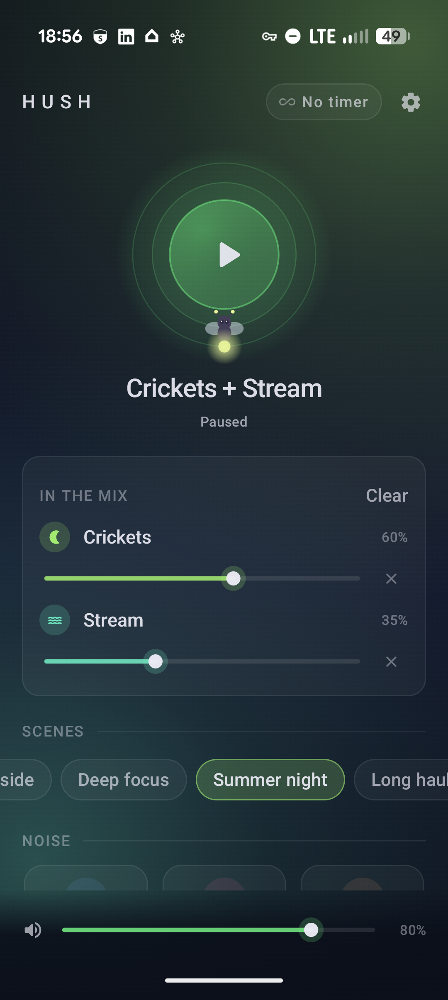
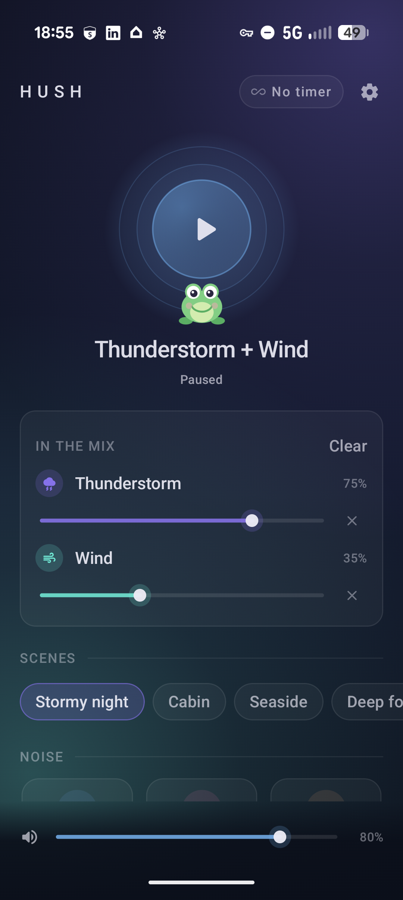

# Hush

**A calm sleep-sound app for Android.** Layer coloured noise and procedurally
synthesized ambience, set a gentle sleep timer, and let it run all night with
lock-screen controls. Every sound is generated on the phone as it plays —
nothing is recorded, bundled, or downloaded, and the app never touches the
network.

<p align="center">
  
  &nbsp;&nbsp;
  
</p>

## Highlights

- **Everything is synthesized.** Sixteen sounds are generated in real time by a
  pure-Kotlin DSP engine — no audio files, so the APK is ~1.7 MB and the sounds
  never loop.
- **Layer up to three** sounds at once, each with its own volume, over a master
  volume.
- **One-tap scenes** — Stormy night, Cabin, Seaside, Deep focus, Summer night,
  Long haul.
- **Sleep timer** with presets, a custom length (5–480 min), a gentle
  equal-power fade-out, and an explicit *until cancelled* mode.
- **Runs all night in the background** — a media foreground service with
  lock-screen and headset controls, a wake lock so deep sleep never stalls
  playback, audio-focus handling (pause on a call, duck for a notification,
  pause when headphones unplug), and resume after the process is killed.
- **A night-sky UI** that tints itself with the sounds in the mix, with one
  quiet breathing animation on the play orb.
- **A companion animal** rests at the base of the orb and changes with the mix
  — a frog for rain, a whale for the ocean, a firefly for crickets, a fox by
  the campfire, and a sleeping cat when all is quiet.
- Built for **modest hardware** (Android 8.0+): the render loop is
  allocation-free, the UI motion budget is tiny, and the release build is
  R8-shrunk.

## Download

Grab the latest signed APK: **[`dist/hush-0.1.4.apk`](dist/hush-0.1.4.apk?raw=1)**
(1.7 MB, Android 8.0+), or from the
[Releases page](../../releases/latest).

To install: allow "install unknown apps" for your browser or file manager, open
the APK, and tap install. Upgrades install in place. Then exclude Hush from
battery optimization so playback runs uninterrupted overnight.

## Sounds

| Category | Sounds |
|---|---|
| **Noise** | White · Pink · Brown · Blue · Violet · Grey |
| **Nature** | Rain · Downpour · Thunderstorm · Ocean · Wind · Campfire · Stream · Crickets |
| **Ambience** | Fan · Airplane cabin |

Each is tuned by ear and calibrated to a consistent loudness so switching
sounds never jumps in volume. How every one is built — the filters, the
event models, the tuning knobs — is written up in
[`docs/sound-design.md`](docs/sound-design.md).

## Build

Requires JDK 21 and an Android SDK with platform 37 (`local.properties` →
`sdk.dir`).

```bash
./gradlew assembleDebug            # app/build/outputs/apk/debug/app-debug.apk
./gradlew assembleRelease          # signed when local.properties has the hush.* keys (docs/release.md)

./gradlew testDebugUnitTest koverVerifyAggregated   # unit suite + coverage gate
./gradlew validateDebugScreenshotTest               # Compose Preview screenshot references
```

To hear the sounds without a device, render every one to a WAV for inspection:

```bash
NOISE_RENDER_DIR=/tmp/hush ./gradlew :core:audio:testDebugUnitTest --tests '*RenderSamples*'
```

## Architecture

```
app/            Compose UI (home, mixer, scenes, catalog, timer & settings sheets)
core/model/     sound catalog, mixes, scenes — pure data
core/audio/     DSP generators, allocation-free MixRenderer, AudioTrack engine
core/playback/  PlaybackController, sleep timer, audio focus, wake lock,
                persistence, Media3 session service
```

One process-wide `PlaybackController` is the single source of truth; the UI is
a pure function of its state, and the foreground service and media session only
mirror it. Android edges (the audio sink, focus, wake lock, persistence) are
interfaces, so the decision logic is unit-tested with fakes and virtual time.

## Tech

Kotlin · Jetpack Compose / Material 3 · Media3 · Koin · Preferences DataStore ·
JUnit 5 + MockK + Turbine · Kover · Compose Preview screenshot tests.

The living specs are in [`specs/`](specs/); design and review notes are in
[`docs/`](docs/).

## Licence

Personal project. Dependencies are Apache-2.0 (AndroidX, Media3, Koin, Kotlin).
