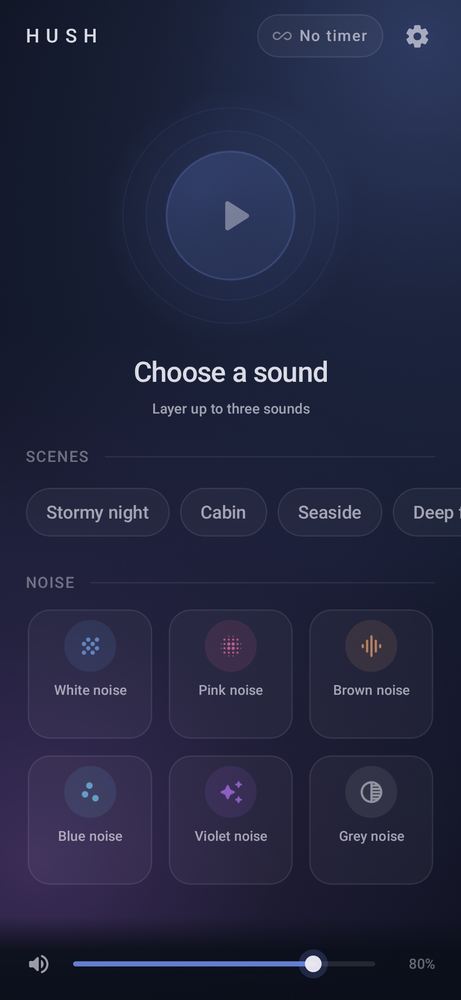
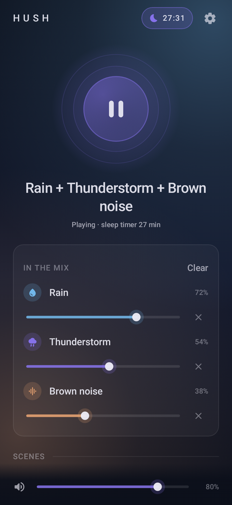
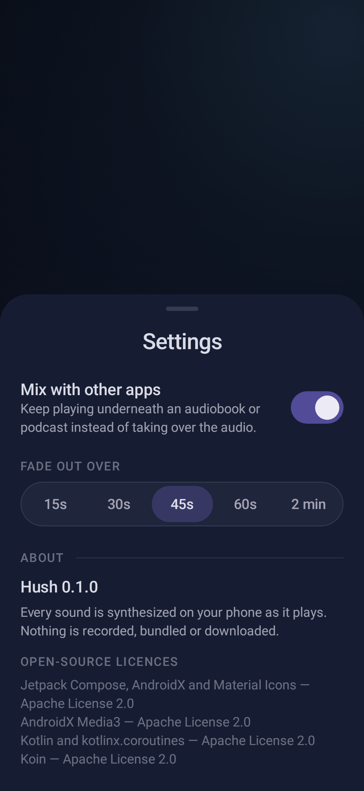

# Hush

A calm Android sleep-sound app. Layer up to three sounds — coloured noise
(white, pink, brown, blue, violet, grey) and procedurally synthesized ambience
(rain, downpour, thunderstorm, ocean, wind, campfire, stream, crickets, fan,
airplane cabin) — set a sleep timer that fades out gently, and let it run all
night in the background with lock-screen controls.

Everything is synthesized on the phone: no recordings, no downloads, no
network, no accounts, no analytics. Built for modest hardware (Android 8.0+).

## Screens
| Home | Playing a mix | Sleep timer | Settings |
|---|---|---|---|
|  |  |  |  |

Rendered by the JVM screenshot tests (`./gradlew updateDebugScreenshotTest`); the
same images are the committed references under `app/src/screenshotTestDebug/`.

## Build
```
./gradlew assembleDebug            # app/build/outputs/apk/debug/app-debug.apk
./gradlew assembleRelease          # signed when local.properties has the hush.* keys (docs/release.md)
./gradlew testDebugUnitTest koverVerifyAggregated
./gradlew validateDebugScreenshotTest
```
Requires JDK 21 and an Android SDK with platform 37 (`local.properties` → `sdk.dir`).

## Layout
- `core/model` — sound catalog, mixes, scenes
- `core/audio` — DSP generators, mixer, `AudioTrack` engine
- `core/playback` — playback controller, sleep timer, audio focus, persistence, media session service
- `app` — Compose UI
- `specs/` — the living specs; `docs/` — architecture, sound design, release, review log

## Licence
Personal project. Dependencies are Apache-2.0 (AndroidX, Media3, Koin, Kotlin).
